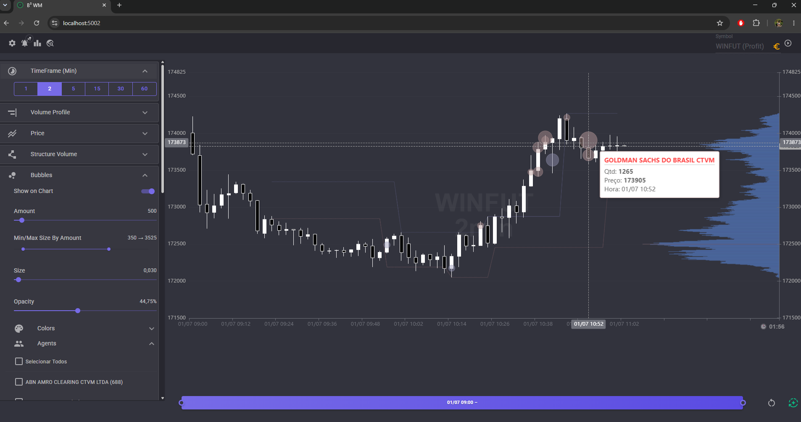
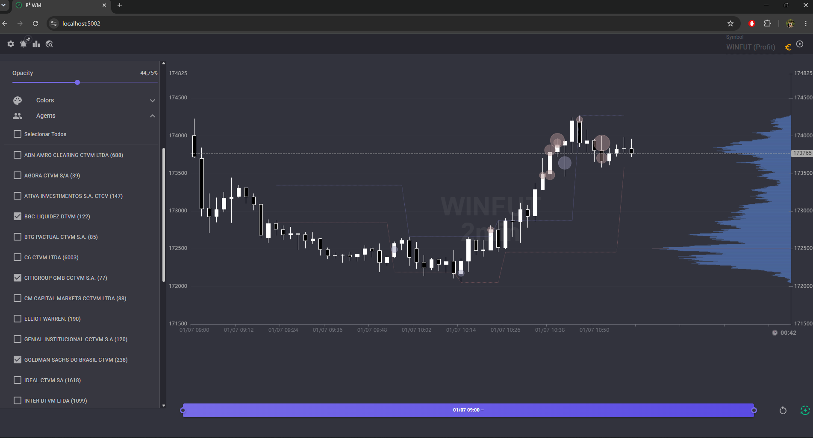
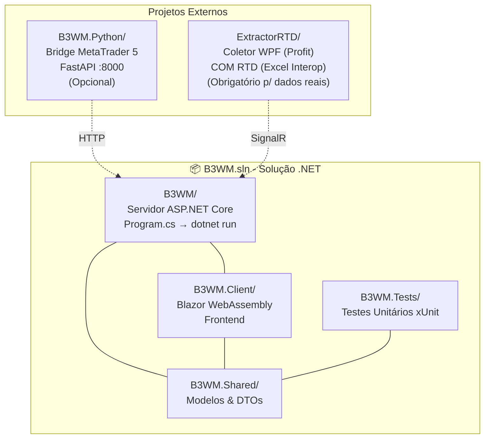
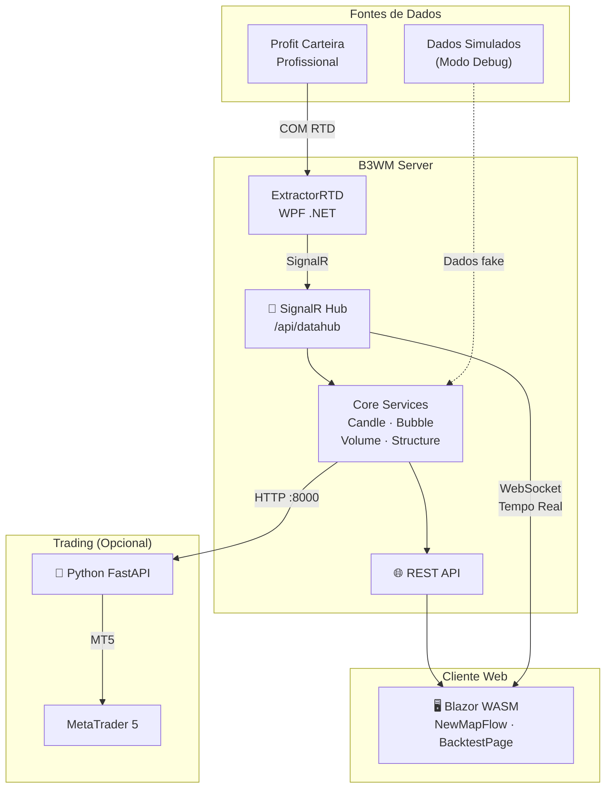

# B3WM — B3 Web Markets

## ⚠️ Aviso Legal / Disclaimer

> Este projeto é **exclusivamente para fins EDUCACIONAIS E DE ESTUDO** do mercado financeiro.
>
> **Não é permitido** o uso comercial, monetização ou distribuição com fins lucrativos.
> A coleta de dados utilizada por este software não autoriza tais usos.
>
> Todo e qualquer uso é de **inteira responsabilidade do usuário**.
> O autor não se responsabiliza por perdas financeiras, decisões de investimento
> ou qualquer dano decorrente do uso deste software.

---

## Sobre

Plataforma **open-source** de visualização em tempo real e estudo de microestrutura do mercado de futuros brasileiro (B3), focada nos contratos **WINFUT** (Mini Índice) e **WDOFUT** (Mini Dólar).

**Objetivo:** Estudar a dinâmica do fluxo de ordens, perfil de volume, agressividade dos participantes e estrutura de preços — tudo em tempo real.

---
> 💡 **Quer ver na prática?** As imagens abaixo mostram o B3WM rodando com dados reais da B3.
> Se você tiver sugestões de outros prints que ajudariam a entender melhor o projeto,
> fique à vontade para contribuir! (veja sugestões ao final da seção)

---

## Prévia

<div align="center">
  
  <p><em>Visão geral com gráfico de candles, bubbles de grandes volumes e perfil de volume (Volume Profile) à direita.</em></p>
</div>

<br/>

<div align="center">
  
  <p><em>Análise detalhada de microestrutura: delta acumulado por nível de preço, identificação de agentes agressores e estrutura de suporte/resistência.</em></p>
</div>

### Prints que ajudariam (contribua!)

Se quiser tornar este README ainda mais completo, capture e envie prints de:

| # | O que capturar | O que mostra |
|---|---|---|
| 1 | Página de **Backtest** — trades no gráfico + métricas | Que o sistema testa estratégias no histórico |
| 2 | **Painel de Trading** — posição aberta, saldo, botões | Integração com MetaTrader 5 para execução real |
| 3 | **Bubbles em close** — candle com bolhas grandes | Detecção de agentes agressivos (diferencial do projeto) |

---

## Funcionalidades

### Visualização em Tempo Real
- Gráfico de candles com múltiplos timeframes (1, 2, 5, 15, 30, 60 min)
- **Bubbles:** Trades agressivos (grandes volumes por mesmo agente) destacados no gráfico
- **Volume Profile:** Perfil de volume por nível de preço com POC (Point of Control)
- **Delta Profile:** Diferença compra-venda por nível (buying/selling pressure)
- **Estruturas de Suporte/Resistência:** Borders calculadas automaticamente com base na ação do preço

### Análise de Microestrutura
- Identificação de agentes compradores/vendedores por corretora
- Detecção de bubbles (sequências de mesmo agente agredindo)
- Análise de delta acumulado por nível de preço
- Reconstrução de perfil de volume por intervalo selecionado

### Backtest de Estratégias
- Motor de backtest server-side em .NET
- Estratégias baseadas em bubbles, volume profile e estrutura de preços
- Visualização dos trades no gráfico (entrada/saída com motivos)
- Métricas: Win Rate, Profit Factor, Drawdown, P&L

### Trading Automatizado (Integração MT5)
- Bridge Python/FastAPI para execução de ordens via MetaTrader 5
- Consulta de posições, saldo e informações de conta

---

## Stack Tecnológica

| Camada | Tecnologia |
|---|---|
| Backend | .NET 10 / ASP.NET Core / SignalR |
| Frontend | Blazor WebAssembly / MudBlazor 9 |
| Charting | ECharts (Vizor.ECharts wrapper) |
| Real-time | SignalR (WebSocket) |
| Trading Bridge | Python 3 / FastAPI / MetaTrader 5 |
| Persistência | JSON (arquivos) + IndexedDB (navegador) |
| Coleta de Dados | WPF / Profit COM RTD (Excel Interop) |

---

## Arquitetura

### Estrutura dos Projetos



### Fluxo de Dados em Execução



---

## Como Rodar

### Pré-requisitos
- .NET 10 SDK
- Python 3.12+ (opcional, para trading)
- MetaTrader 5 (opcional, para trading)
- Profit (Carteira Profissional) ou fonte de dados B3 (opcional, para dados reais)

### Ordem de Inicialização

```
1️⃣ Servidor Web (obrigatório) — inicia primeiro
2️⃣ Fonte de dados (real ou simulada) — conecta ao servidor
3️⃣ Trading Bridge (opcional) — conecta ao servidor
4️⃣ Testes — podem rodar a qualquer momento
```

### 1. Servidor Web (Obrigatório)

```bash
dotnet run --project B3WM/B3WM
```

Acesse em: **https://localhost:5002**

> O servidor já inclui o frontend Blazor WASM. Tudo em um único processo.

### 2. Fonte de Dados

#### Opção A — Dados Reais (requer Profit Carteira Profissional)

Abra `ExtractorRTD/B3WM.ExtractorRTD.sln` no Visual Studio e compile.

O ExtractorRTD se conecta ao Profit via **COM RTD** (RealTime Data — servidor COM exposto pelo Profit)
e envia os dados para o servidor B3WM via SignalR.

> ⚠️ O Profit Carteira Profissional deve estar aberto com o **suplemento RTD Trading** habilitado
> para que o servidor COM `rtdtrading.rtdserver` esteja disponível.

#### Opção B — Dados Simulados (Modo Debug)

Nenhuma ação necessária. Em modo **Debug**, o servidor gera dados falsos automaticamente para desenvolvimento e testes.

### 3. Trading Bridge — MetaTrader 5 (Opcional)

```bash
cd B3WM.Python
pip install -r requirements.txt
python main.py
```

O servidor FastAPI inicia em **http://localhost:8000** e o B3WM Server se conecta a ele automaticamente.

### 4. Testes

```bash
dotnet test B3WM.Tests
```

---

## Estrutura do Projeto

```
B3WM.sln                          # Solução principal (.NET 10)
│
├── B3WM/                         # 🖥️ Servidor ASP.NET Core + SignalR
│   ├── Program.cs                #    Entry point do servidor
│   ├── Services/Core/            #    Candle, Bubble, Volume, Structure
│   ├── Services/Backtest/        #    BacktestEngine, SmartBreakoutStrategy
│   ├── Controllers/              #    REST API endpoints
│   ├── Data/                     #    Persistência (JSON)
│   ├── Components/               #    Componentes Server-Side
│   └── wwwroot/                  #    Arquivos estáticos
│
├── B3WM.Client/                  # 🌐 Frontend Blazor WebAssembly
│   ├── Pages/                    #    NewMapFlow, BacktestPage
│   ├── Components/               #    TradingDrawer, Charts
│   └── Services/                 #    Serviços HTTP/SignalR (cliente)
│
├── B3WM.Shared/                  # 📦 Modelos, DTOs, Interfaces
│
├── B3WM.Tests/                   # ✅ Testes unitários (xUnit)
│
├── B3WM.Python/                  # 🐍 Bridge MetaTrader 5 (FastAPI)
│   └── main.py                   #    Entry point (python main.py)
│
└── ExtractorRTD/                 # 📡 Coletor WPF (Profit RTD via COM)
    └── B3WM.ExtractorRTD.sln     #    Solução separada (.NET Framework)
```

---

## Licença

**GNU Affero General Public License v3.0 (AGPLv3)** — Uso exclusivamente educacional.

Este software é fornecido "como está", sem garantia de qualquer tipo.
O uso comercial ou monetização deste software é **expressamente proibido**.

### AGPLv3 em resumo
- ✅ **Estudo e aprendizado** — Livre para estudar, modificar e experimentar
- ✅ **Uso pessoal** — Pode usar para análise pessoal do mercado
- ⚠️ **Compartilhamento** — Se distribuir o código ou versões modificadas, deve manter a mesma licença AGPLv3
- ⚠️ **Serviços web** — Se rodar uma versão modificada como servidor web, **precisa disponibilizar o código fonte** aos usuários
- ❌ **Uso comercial fechado** — Não pode incorporar em produtos comerciais sem abrir o código
- ❌ **Monetização** — Não é permitido vender este software ou versões derivadas sem manter o código aberto

Veja o arquivo [LICENSE](LICENSE) para o texto completo.

---

## Aviso de Risco

Negociar futuros envolve risco significativo de perda financeira.
Este software **não** fornece recomendações de investimento, sinais de compra/venda
ou qualquer forma de aconselhamento financeiro.
**Use por sua conta e risco.**

---

## Autor

**Mateus Faria** — [GitHub](https://github.com/WebMat1)
