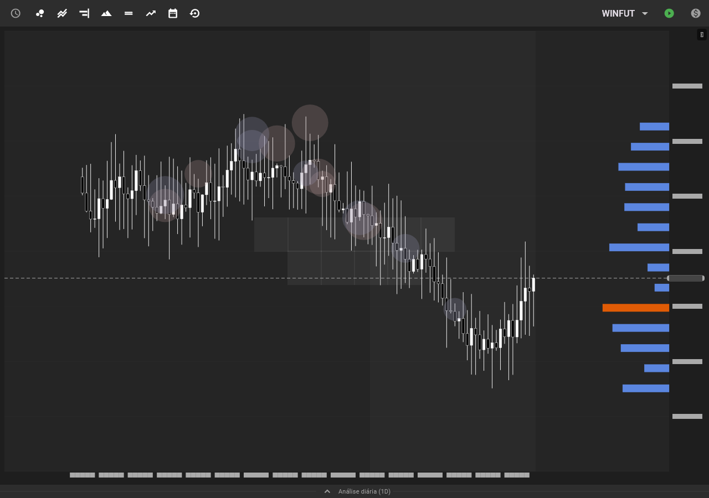
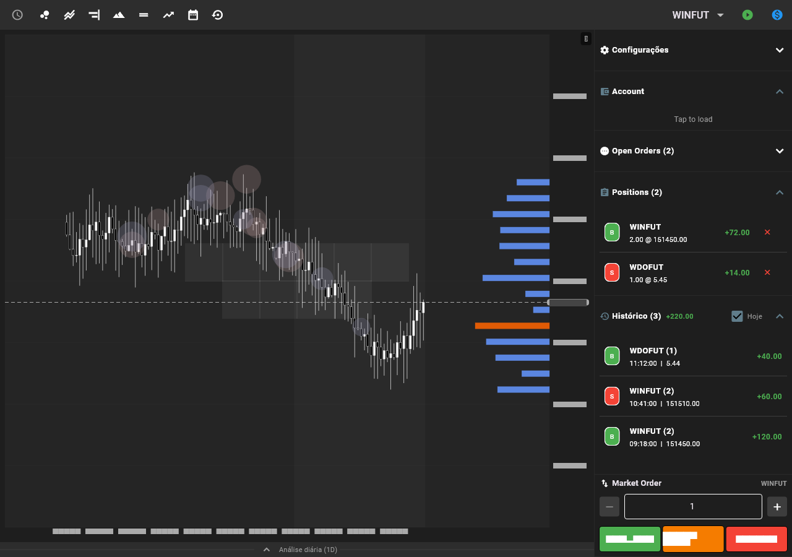
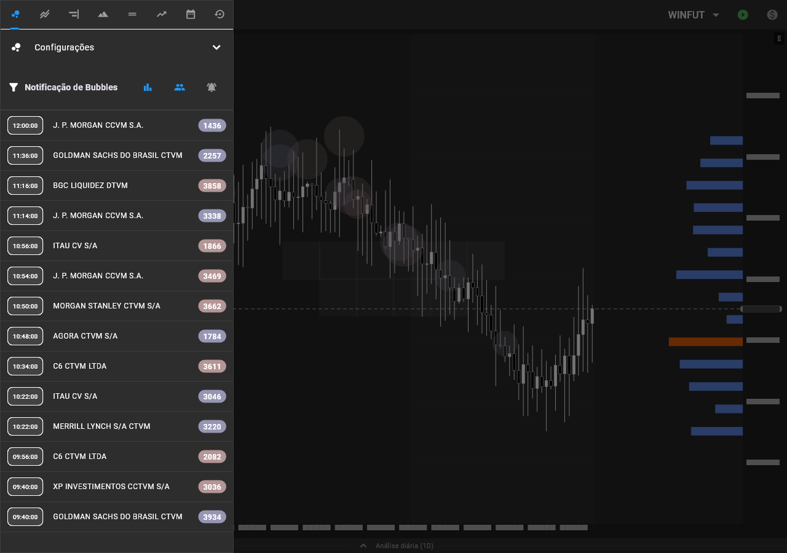
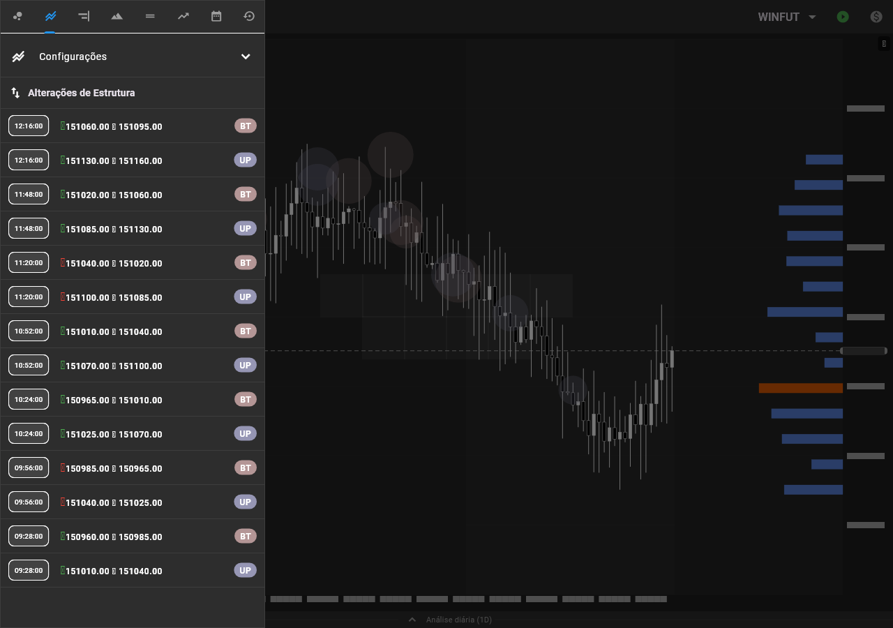
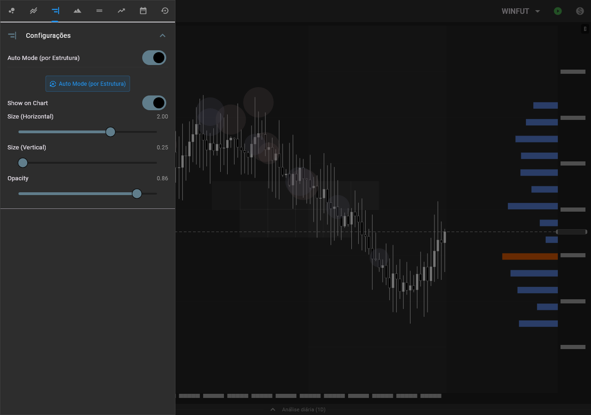
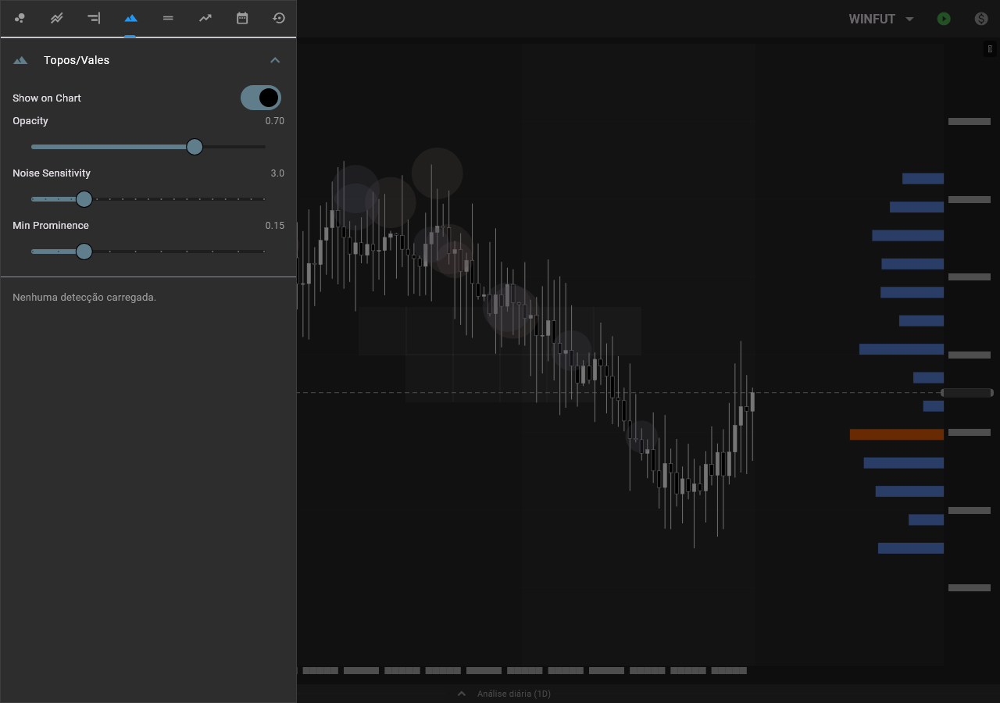
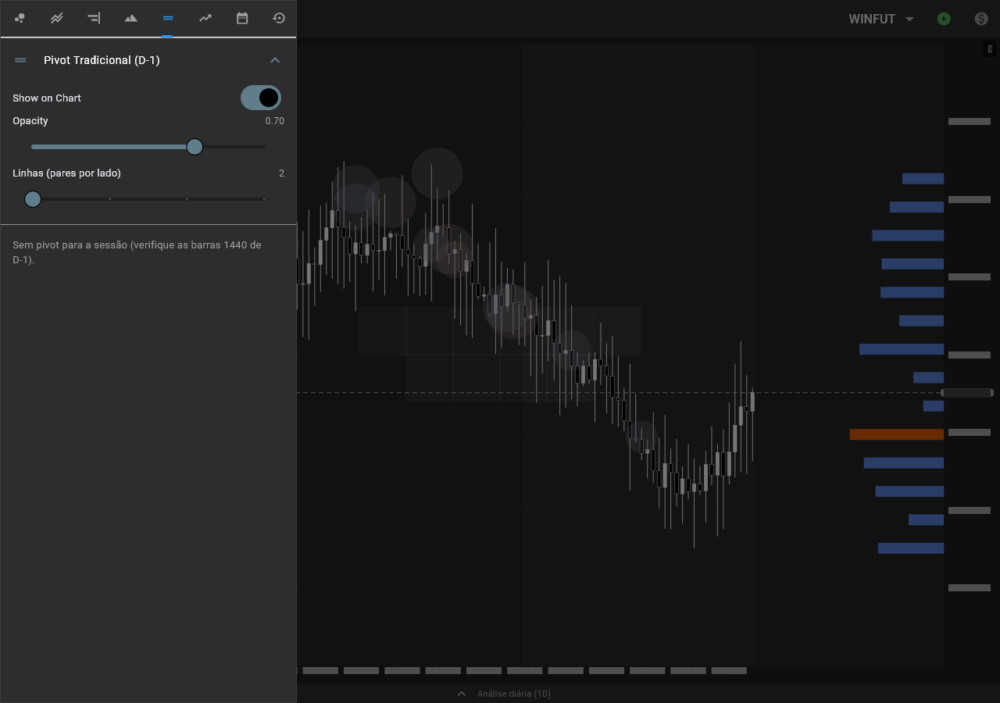
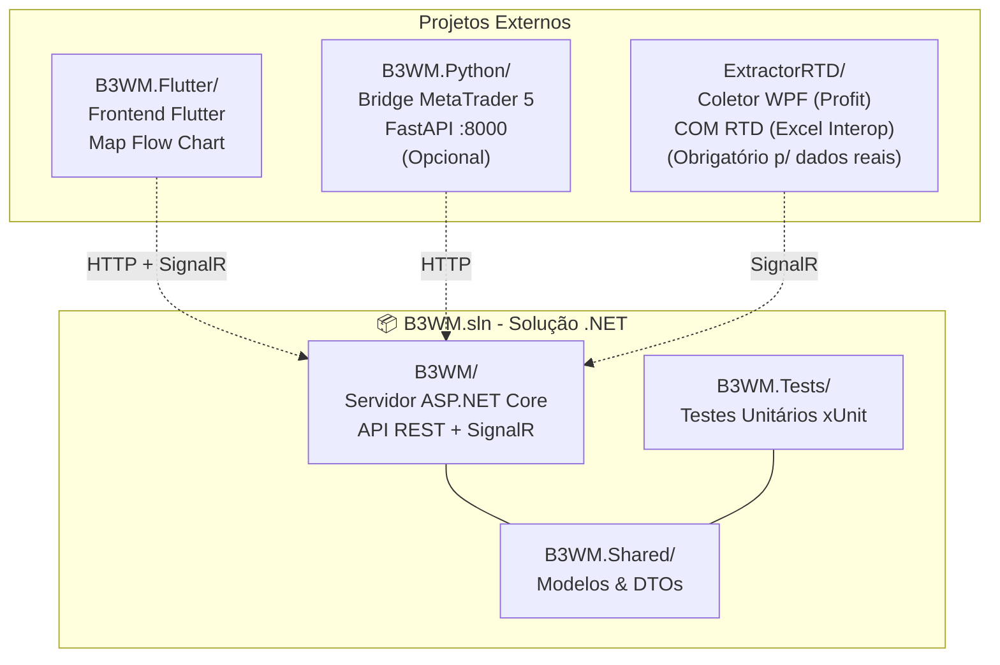
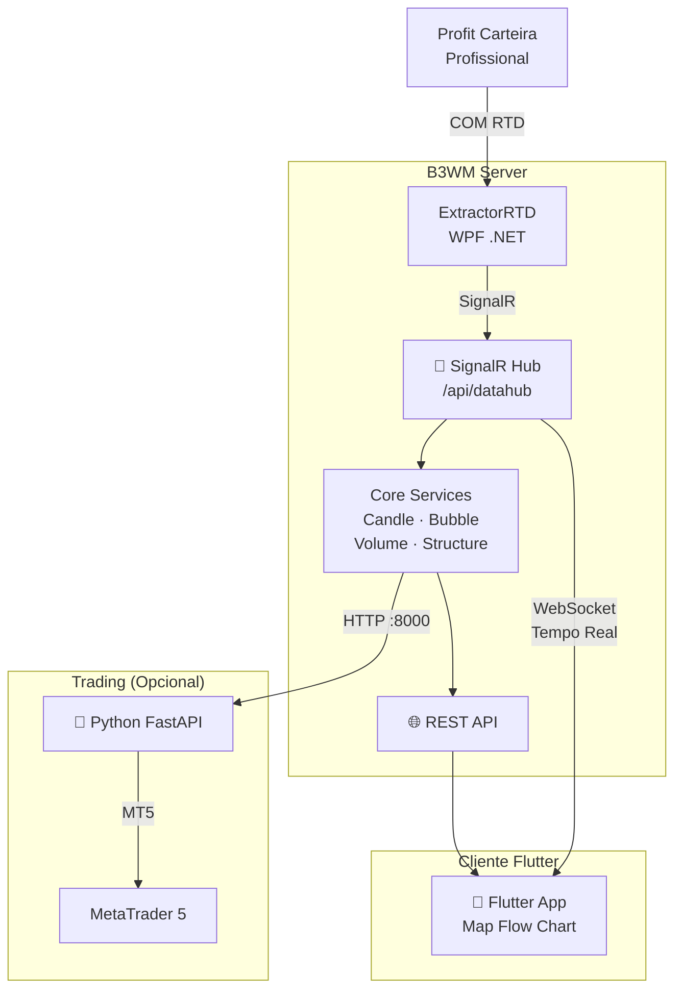

# B3WM — B3 Web Markets

## ⚠️ Aviso Legal / Disclaimer

> Este projeto é **exclusivamente para fins EDUCACIONAIS E DE ESTUDO** do mercado financeiro.
>
> **Não é permitido** o uso comercial, monetização ou distribuição com fins lucrativos.
> A coleta de dados utilizada por este software não autoriza tais usos.
>
> Todo e qualquer uso é de **inteira responsabilidade do usuário**.
> O autor não se responsabiliza por perdas financeiras, decisões de investimento
> ou qualquer dano decorrente do uso deste software.

---

## Sobre

Plataforma **open-source** de visualização em tempo real e estudo de microestrutura do mercado de futuros brasileiro (B3), focada nos contratos **WINFUT** (Mini Índice) e **WDOFUT** (Mini Dólar).

**Objetivo:** Estudar a dinâmica do fluxo de ordens, perfil de volume, agressividade dos participantes e estrutura de preços — tudo em tempo real.

---

> 💡 **Quer ver na prática?** As imagens abaixo são **geradas automaticamente por testes
> golden** do próprio frontend Flutter (`B3WM.Flutter/test/screenshots_golden_test.dart`),
> usando dados de exemplo. Elas refletem o estado atual da interface — sem necessidade de
> conectar a dados reais da B3.

---

## Prévia

<div align="center">
  
  <p><em>Visão geral do gráfico: candles, bubbles de grandes volumes, linhas de estrutura (suporte/resistência) e perfil de volume à direita.</em></p>
</div>

<br/>

<div align="center">
  
  <p><em>Painel de trading (integração MT5): ordem de mercado, conta, ordens em aberto, posições e histórico.</em></p>
</div>

### Abas do Drawer (intraday)

O drawer lateral organiza as ferramentas de análise em abas (ícones na AppBar abrem direto na aba correspondente):

#### 📊 Bubbles
<div align="center">
  
  <p><em>Trades agressivos (grandes volumes do mesmo agente), com configurações e lista filtrada por tamanho mínimo.</em></p>
</div>

#### 📐 Estrutura
<div align="center">
  
  <p><em>Alterações de estrutura (upgrades/downgrades de suporte e resistência) em tempo real.</em></p>
</div>

#### 📈 Volume Profile
<div align="center">
  
  <p><em>Perfil de volume com modo automático (por estrutura), seleção de horário e controles de exibição, tamanho e opacidade.</em></p>
</div>

#### ⛰️ Topos/Vales
<div align="center">
  
  <p><em>Detecção de topos/vales (ExtremeService) com sensibilidade a ruído e proeminência mínima ajustáveis.</em></p>
</div>

#### ➖ Pivot Tradicional (novo)
<div align="center">
  
  <p><em>Pivot Tradicional estilo Profit no intraday (fonte HLC de D-1, 2–5 pares de níveis). Sem dados de D-1, a aba mostra os controles e a mensagem de sessão sem pivot.</em></p>
</div>

Outras abas sem screenshot dedicado: **VWAP Diário**, **Período / Dados Históricos** e **Backup (exportar/importar)**.

> ℹ️ O **Verifier** (backtest manual) está **desabilitado** no momento — o código segue em `lib/ui/widgets/verifier_drawer.dart`, mas sem aba ativa.

### Análise diária (painel inferior 1D)

O rodapé **“Análise diária (1D)”** expande um painel com gráfico diário e 4 abas próprias: **Estrutura 1D**, **Volume Profile 1D**, **Topos/Vales 1D** e **Pivot Tradicional 1D** (fonte HLC da semana anterior, fiel ao Profit).
---

## Funcionalidades

### Visualização em Tempo Real
- Gráfico de candles com múltiplos timeframes (1, 2, 5, 15, 30, 60 min)
- **Bubbles:** Trades agressivos (grandes volumes por mesmo agente) destacados no gráfico
- **Volume Profile:** Perfil de volume por nível de preço com POC (Point of Control)
- **Delta Profile:** Diferença compra-venda por nível (buying/selling pressure)
- **Estruturas de Suporte/Resistência:** Borders calculadas automaticamente com base na ação do preço
- **Topos/Vales:** Detecção de extremos com `NoiseSensitivity` e `MinimumProminence` ajustáveis
- **Pivot Tradicional:** Níveis estilo Profit — intraday com HLC de D-1, diário (1D) com HLC da semana anterior
- **VWAP Diário** e painel de **análise diária (1D)** com estrutura, volume, topos/vales e pivot próprios

### Análise de Microestrutura
- Identificação de agentes compradores/vendedores por corretora
- Detecção de bubbles (sequências de mesmo agente agredindo)
- Análise de delta acumulado por nível de preço
- Reconstrução de perfil de volume por intervalo selecionado

### Backtest de Estratégias
- Motor de backtest server-side em .NET
- Estratégias baseadas em bubbles, volume profile e estrutura de preços
- Visualização dos trades no gráfico (entrada/saída com motivos)
- Métricas: Win Rate, Profit Factor, Drawdown, P&L

### Trading Automatizado (Integração MT5)
- Bridge Python/FastAPI para execução de ordens via MetaTrader 5
- Consulta de posições, saldo e informações de conta

---

## Stack Tecnológica

| Camada | Tecnologia |
|---|---|
| Backend | .NET 10 / ASP.NET Core / SignalR |
| Frontend | Flutter (desktop / mobile) |
| Charting | CustomPainter (Flutter) |
| Real-time | SignalR (WebSocket) |
| Trading Bridge | Python 3 / FastAPI / MetaTrader 5 |
| Persistência | JSON (arquivos) |
| Coleta de Dados | WPF / Profit COM RTD (Excel Interop) |

---

## Arquitetura

### Estrutura dos Projetos


```mermaid
graph TB
    subgraph SOL["📦 B3WM.sln - Solução .NET"]
        direction TB
        API["B3WM/<br/>Servidor ASP.NET Core<br/>API REST + SignalR"]
        SHARED["B3WM.Shared/<br/>Modelos & DTOs"]
        TESTS["B3WM.Tests/<br/>Testes Unitários xUnit"]
        API --- SHARED
        TESTS --- SHARED
    end

    subgraph EXT["Projetos Externos"]
        FLUTTER["B3WM.Flutter/<br/>Frontend Flutter<br/>Map Flow Chart"]
        PYTHON["B3WM.Python/<br/>Bridge MetaTrader 5<br/>FastAPI :8000<br/>(Opcional)"]
        RTD["ExtractorRTD/<br/>Coletor WPF (Profit)<br/>COM RTD (Excel Interop)<br/>(Obrigatório p/ dados reais)"]
    end

    FLUTTER -.->|HTTP + SignalR| API
    PYTHON -.->|HTTP| API
    RTD -.->|SignalR| API
```

### Fluxo de Dados em Execução


```mermaid
graph TD
    PROFIT["Profit Carteira<br/>Profissional"]

    subgraph SERVER["B3WM Server"]
        EXTRACT["ExtractorRTD<br/>WPF .NET"] -->|SignalR| HUB["📡 SignalR Hub<br/>/api/datahub"]
        HUB --> CORE["Core Services<br/>Candle · Bubble<br/>Volume · Structure"]
        CORE --> REST["🌐 REST API"]
    end

    subgraph CLIENTE["Cliente Flutter"]
        REST --> APP["📱 Flutter App<br/>Map Flow Chart"]
        HUB -->|WebSocket<br/>Tempo Real| APP
    end

    subgraph TRADING["Trading (Opcional)"]
        PY["🐍 Python FastAPI"] -->|MT5| MT5["MetaTrader 5"]
        CORE -->|HTTP :8000| PY
    end

    PROFIT -->|COM RTD| EXTRACT
```

---

## Como Rodar (fork do zero)

### Pré-requisitos
- **Git**, **.NET 10 SDK**
- **Flutter SDK** (testado com Flutter 3.44 / Dart 3.12) — veja detalhes em [B3WM.Flutter/README.md](B3WM.Flutter/README.md)
- **Python 3.12+ no Windows** (opcional, só para o bridge MT5) — veja [B3WM.Python/README.md](B3WM.Python/README.md)
- **MetaTrader 5** (opcional, para trading) e **Profit Carteira Profissional** (opcional, para dados reais)

### 0. Clonar e confiar no certificado local

```bash
git clone https://github.com/WebMat-SA/B3WM.git
cd B3WM
dotnet dev-certs https --trust   # o Flutter fala com https://localhost:5002 (cert self-signed)
```

> 📁 A pasta **`/Data/` (JSONs diários gerados pelo servidor) é ignorada pelo git** (`.gitignore`) — ela é criada/usada em runtime e **não** vai para o PR. O legado `/B3WM/Data/` segue ignorado também.

### Ordem de Inicialização

```
1️⃣ Servidor Web (obrigatório) — inicia primeiro
2️⃣ App Flutter — conecta ao servidor via API/SignalR
3️⃣ Fonte de dados (real) — conecta ao servidor
4️⃣ Trading Bridge (opcional) — conecta ao servidor
5️⃣ Testes — podem rodar a qualquer momento
```

| Serviço | Porta padrão | Config |
|---|---|---|
| B3WM Server (HTTPS) | `https://localhost:5002` (+ `http://localhost:5000`) | `B3WM/Properties/launchSettings.json`, `B3WM/appsettings.json` |
| SignalR Hub | `https://localhost:5002/api/datahub` | `B3WM/Program.cs` |
| Python MT5 Bridge | `http://localhost:8000` | `PythonService:BaseUrl` no `appsettings.json`; URL do Flutter em `B3WM.Flutter/lib/main.dart` (`baseUrl`) |

### 1. Servidor Web (Obrigatório)

```bash
dotnet run --project B3WM --launch-profile https
```

O servidor inicia em **https://localhost:5002** expondo apenas a **API REST** e o **SignalR Hub** (`/api/datahub`).

### 2. App Flutter (Frontend)

O frontend foi reescrito em **Flutter** e substitui o antigo cliente Blazor WebAssembly.

```bash
cd B3WM.Flutter
flutter pub get
flutter run -d windows   # ou -d chrome / -d android
```

> O app conecta-se a **https://localhost:5002** por padrão (`baseUrl` em `lib/main.dart`).
> Troque o `baseUrl` se o backend estiver em outra máquina.
> - **Windows/Chrome:** com o `dotnet dev-certs https --trust` feito acima, o HTTPS local funciona.
> - **Android emulador:** use `https://10.0.2.2:5002` em vez de `localhost`.
> - **Android físico / outro dispositivo:** use `https://<IP-da-sua-máquina>:5002` e aceite o certificado.

### 3. Fonte de Dados

#### Opção A — Dados Reais (requer Profit Carteira Profissional)

Abra `ExtractorRTD/B3WM.ExtractorRTD.sln` no Visual Studio e compile.

O ExtractorRTD se conecta ao Profit via **COM RTD** (RealTime Data — servidor COM exposto pelo Profit)
e envia os dados para o servidor B3WM via SignalR.

> ⚠️ O Profit Carteira Profissional deve estar aberto com o **suplemento RTD Trading** habilitado
> para que o servidor COM `rtdtrading.rtdserver` esteja disponível.

### 4. Trading Bridge — MetaTrader 5 (Opcional)

```bash
cd B3WM.Python
pip install -r requirements.txt
uvicorn main:app --host 0.0.0.0 --port 8000 --reload
```

O servidor FastAPI inicia em **http://localhost:8000** e o B3WM Server se conecta a ele automaticamente.

### 5. Testes

```bash
dotnet test B3WM.Tests                       # Testes unitários do servidor (.NET, inclui PivotServiceTests)
cd B3WM.Flutter && flutter test              # Testes do frontend (widget + golden)
```

Para **regenerar as screenshots** do README (goldens com dados de exemplo, sem precisar de dados reais):

```bash
cd B3WM.Flutter
flutter test test/screenshots_golden_test.dart --update-goldens
cp test/goldens/overview.png test/goldens/drawer_bubbles.png test/goldens/drawer_estrutura.png test/goldens/drawer_volume_profile.png test/goldens/drawer_extreme.png test/goldens/drawer_pivot.png test/goldens/trading_panel.png ../screenshots/
```

> Os goldens cobrem: visão geral, Bubbles, Estrutura, Volume Profile, **Topos/Vales**, **Pivot Tradicional** e painel de trading. VWAP/Período/Backup e o painel 1D ainda não têm goldens dedicados.

---

## Estrutura do Projeto

```
B3WM.sln                          # Solução principal (.NET 10)
│
├── B3WM/                         # 🖥️ Servidor ASP.NET Core + SignalR
│   ├── Program.cs                #    Entry point (https://localhost:5002, hub /api/datahub)
│   ├── Services/Core/            #    Candle, Bubble, Volume, Structure, Extreme, PivotService
│   ├── Services/Backtest/        #    BacktestEngine, SmartBreakoutStrategy
│   ├── Controllers/              #    REST API endpoints (incl. DataController: pivot/extreme/daily)
│   └── appsettings.json          #    PythonService:BaseUrl (http://localhost:8000)
│
├── Data/                         # 📁 JSONs diários gerados em runtime (IGNORADO pelo git)
│
├── B3WM.Shared/                  # 📦 Modelos, DTOs, Interfaces (incl. PivotStorageItem)
│
├── B3WM.Tests/                   # ✅ Testes unitários (xUnit, inclui PivotServiceTests)
│
├── B3WM.Flutter/                 # 📱 Frontend Flutter (Map Flow Chart)
│   ├── lib/main.dart             #    Entry point do app (baseUrl https://localhost:5002)
│   ├── lib/services/             #    Serviços HTTP/SignalR (cliente)
│   ├── lib/ui/widgets/chart/     #    Gráfico Map Flow (CustomPainter)
│   ├── lib/ui/widgets/           #    Drawers: bubble/structure/volume/extreme/pivot/vwap/backup/trading
│   ├── lib/ui/widgets/daily/     #    Painel inferior 1D (structure/volume/extreme/pivot)
│   └── test/                     #    Widget + golden tests (test/goldens/ → screenshots/)
│
├── B3WM.Python/                  # 🐍 Bridge MetaTrader 5 (FastAPI, Windows-only)
│   ├── main.py                   #    Entry point (uvicorn :8000)
│   ├── models/                   #    order.py, ticks.py
│   └── services/                 #    order_executor.py, mt5.py, contract_utils.py (rolagem WIN/WDO)
│
└── ExtractorRTD/                 # 📡 Coletor WPF (Profit RTD via COM)
    └── B3WM.ExtractorRTD.sln     #    Solução separada (.NET Framework)
```

---

## Nota de Migração

O antigo frontend **Blazor WebAssembly** (`B3WM/B3WM.Client`) foi **removido** do repositório
e substituído pelo cliente **Flutter** (`B3WM.Flutter`). O servidor .NET permanece como backend
(API REST + SignalR) consumido pelo novo frontend. O histórico do git preserva o código Blazor
removido, caso seja necessário consultá-lo.

---

## Licença

**GNU Affero General Public License v3.0 (AGPLv3)** — Uso exclusivamente educacional.

Este software é fornecido "como está", sem garantia de qualquer tipo.
O uso comercial ou monetização deste software é **expressamente proibido**.

### AGPLv3 em resumo
- ✅ **Estudo e aprendizado** — Livre para estudar, modificar e experimentar
- ✅ **Uso pessoal** — Pode usar para análise pessoal do mercado
- ⚠️ **Compartilhamento** — Se distribuir o código ou versões modificadas, deve manter a mesma licença AGPLv3
- ⚠️ **Serviços web** — Se rodar uma versão modificada como servidor web, **precisa disponibilizar o código fonte** aos usuários
- ❌ **Uso comercial fechado** — Não pode incorporar em produtos comerciais sem abrir o código
- ❌ **Monetização** — Não é permitido vender este software ou versões derivadas sem manter o código aberto

Veja o arquivo [LICENSE](LICENSE) para o texto completo.

---

## Aviso de Risco

Negociar futuros envolve risco significativo de perda financeira.
Este software **não** fornece recomendações de investimento, sinais de compra/venda
ou qualquer forma de aconselhamento financeiro.
**Use por sua conta e risco.**

---

## Autor

**Mateus Faria** — [GitHub](https://github.com/WebMat1)
